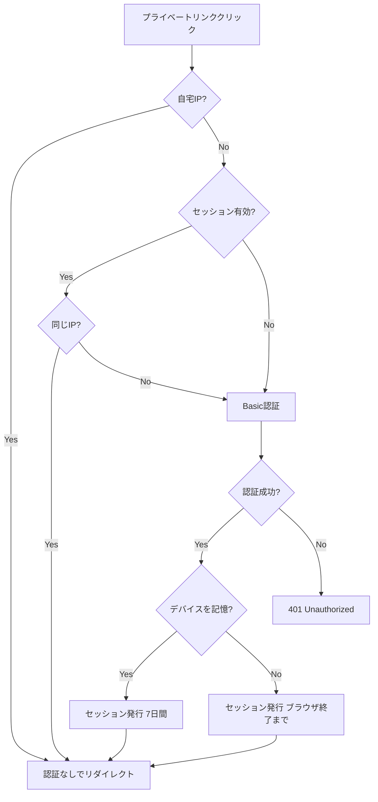

## 認証フロー

```mermaid
flowchart TD
    A[プライベートリンククリック] --> B{自宅IP?}
    B -->|Yes| C[認証なしでリダイレクト]
    B -->|No| D{セッション有効?}
    D -->|Yes| E{同じIP?}
    E -->|Yes| C
    E -->|No| F[Basic認証]
    D -->|No| F
    F --> G{認証成功?}
    G -->|Yes| H{デバイスを記憶?}
    H -->|Yes| I[セッション発行 7日間]
    H -->|No| J[セッション発行 ブラウザ終了まで]
    I --> C
    J --> C
    G -->|No| K[401 Unauthorized]
```